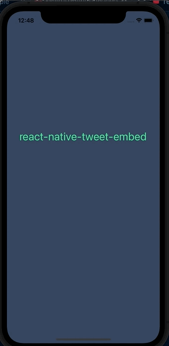

# react-native-tweet-embed

Embed a specific tweet in a React Native view



## Installation

```sh
yarn react-native-tweet-embed
```

or

```sh
npm install --save react-native-tweet-embed
```

This component uses a native ios and Android module to optimize fetching the twitter widget js blob.

## react-native version >= v60

Linking is handled automatically. You must install pods only.

```sh
cd ios && pod install
```

## react-native version < v60

Link the native modules with the following command

```sh
react-native link react-native-tweet-embed
```

## Usage

```js
import { TweetEmbed } from 'react-native-tweet-embed';
// ...

<TweetEmbed tweetId={'1236076554909872128'} />;
```

## License

MIT

## License

MIT
